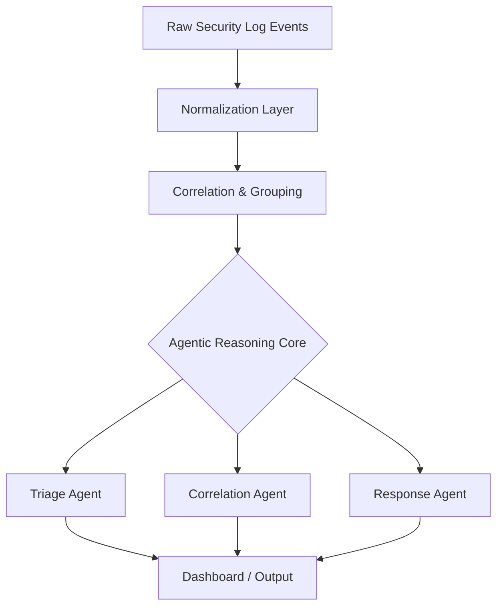

<div align="center">
 


  <br/>

  
  
  
  
  
  
  

  <h3>Multi-agent AI correlation engine for SOC alert triage</h3>
  <p><i>Turning thousands of raw security events into a handful of decisions an analyst can actually act on.</i></p>

  <p>
    <a href="#the-problem">Problem</a> •
    <a href="#the-gap">Gap</a> •
    <a href="#key-innovation">Key Innovation</a> •
    <a href="#architecture">Architecture</a> •
    <a href="#detection-capabilities">Detection</a> •
    <a href="#quickstart">Quickstart</a> •
    <a href="#demo">Demo</a> •
    <a href="#scope--limitations">Scope</a> •
    <a href="#tech-stack">Tech Stack</a> •
    <a href="#roadmap">Roadmap</a> •
    <a href="#team">Team</a>
  </p>
</div>

---

## The Problem

Modern SOCs are drowning in volume, not blind to threats. A mid-size security team can face **thousands of raw log events and alerts per day** across SIEM, EDR, and network tooling — the vast majority low-signal, duplicative, or false positives. Analysts spend most of their time triaging noise instead of investigating real incidents, and alert fatigue causes genuine threats to get missed or delayed.

Existing correlation rules are static, brittle, and written for yesterday's attack patterns. They don't reason about *why* a cluster of events matters — they just pattern-match on fixed thresholds.

## The Gap

Most "AI for SOC" tooling today falls into one of two buckets:

- **Single black-box LLM calls** that summarize alerts but don't reason step-by-step, can't explain their severity scoring, and don't cooperate with each other.
- **Rule-based correlation engines** that are fast and explainable but can't adapt to novel attack chains or unseen log formats.

Nobody is combining **structured, multi-stage agentic reasoning** with the transparency a SOC analyst actually needs to trust and act on a verdict.

## Key Innovation

CorrelSOC replaces the single black-box call with **three cooperating agents** that each own one stage of the reasoning process:

| Agent | Role |
|---|---|
| **Triage Agent** | Normalizes and scores incoming events, filters obvious noise |
| **Correlation Agent** | Groups related events into candidate incidents across time/source/entity |
| **Response Agent** | Reasons over each candidate incident, assigns severity, and drafts a recommended action |

This makes the reasoning **inspectable at every stage** — you can see *why* an incident was flagged, not just that it was — which is the difference between a tool analysts rubber-stamp and one they actually trust.

## Architecture




Five layers, top to bottom: raw events are normalized, correlated into candidate incident clusters, reasoned over by the three-agent core in parallel, and converged into a single ranked view on the dashboard.

## Detection Capabilities

| Category | Example Patterns Detected | Status |
|---|---|---|
| Brute-force / credential attacks | Repeated auth failures, password-spray patterns | ✅ Implemented |
| Lateral movement | Unusual host-to-host access chains | ✅ Implemented |
| Data exfiltration signals | Abnormal outbound volume/timing | 🔄 In progress |
| Privilege escalation | Sudden permission/role changes | 🔄 In progress |
| Living-off-the-land techniques | Legitimate tool misuse (e.g., PowerShell chains) | 🧪 Experimental |
| Insider-threat heuristics | Atypical access-time/location combinations | 📋 Planned |

> ⚠️ *Fill in with your actual eval results once the eval pipeline is fixed — don't ship placeholder numbers as if they're real.*

## Quickstart

```bash
# Clone the repo
git clone https://github.com/<your-org>/correlsoc.git
cd correlsoc

# Install dependencies
pip install -r requirements.txt

# Set your API key
export ANTHROPIC_API_KEY="your-key-here"

# Run the dashboard
streamlit run app.py
```

The dashboard will be available at `http://localhost:8501`.

## Demo

<div align="center">
  
</div>

> Add a short screen-recording GIF or link to a hosted demo video here.

## Scope & Limitations

- Currently tuned for structured log formats (JSON/syslog); unstructured free-text logs need a custom parser.
- Agents run sequentially per batch, not yet streaming — real-time ingestion is on the roadmap.
- Severity scoring is calibrated on the sample dataset used during development; production deployments should re-calibrate thresholds against their own baseline traffic.
- Not a replacement for a full SIEM — CorrelSOC sits on top of existing log sources as a correlation/triage layer.

## Tech Stack

| Layer | Technology |
|---|---|
| Agentic reasoning | Claude (Anthropic API) |
| Dashboard / UI | Streamlit, Plotly |
| Data processing | Pandas, NumPy |
| Validation / schemas | Pydantic |
| Correlation / ML | scikit-learn |
| Language | Python 3.11 |

## Project Structure

```
correlsoc/
├── app.py                  # Streamlit dashboard entry point
├── agents/
│   ├── triage_agent.py
│   ├── correlation_agent.py
│   └── response_agent.py
├── pipeline/
│   ├── normalize.py
│   └── correlate.py
├── data/
│   └── sample_logs/
├── assets/
│   ├── banner.png
│   ├── architecture.png
│   └── demo.gif
├── docs/
│   └── architecture.md
├── requirements.txt
└── README.md
```

## Roadmap

- [ ] Fix and finalize evaluation pipeline (real precision/recall numbers)
- [ ] Real-time / streaming ingestion
- [ ] Data-exfiltration and privilege-escalation detection out of experimental
- [ ] Pluggable connectors for common SIEM/log sources
- [ ] Analyst feedback loop to fine-tune severity scoring over time

## Team

| Name | Role |
|---|---|
| Madhumitha K | Cloud Security Intern |


---

<div align="center">
  <sub>Built for [hackathon/event name] — CorrelSOC, 2026.</sub>
</div>
